# Snapshot of current insights from Digital Explorer
as of August 10th

- [Life of a trend](Life-of-a-trend)

## Demand Reports
- [Top 10 trends](Top-10-trends)
- [Top 10 focus areas](Top-10-focus-areas)
- [Top 10 Strategic Trends](Top-10-Strategic-Trends)

:bulb: All the demand reports here can be run directly within the [DE Platform](https://digitalexplorer.dxc.com/bvr/insights)

## Deliver Report
- [Top trends within delivered Solutions](Top-trends-within-delivered-Solutions)

## Note on the current dataset
Digital Explorer is still being rolled out across DXC, a number of regions have not yet included their innovation agendas within the platform.

|Region|Number of Innovation Agendas
|---|---|
|AMS|32
|ANZ|0
|Asia|0
|N & C Europe|17
|S Europe| 0
|UKIIMEA| 24

---

## Life of a trend

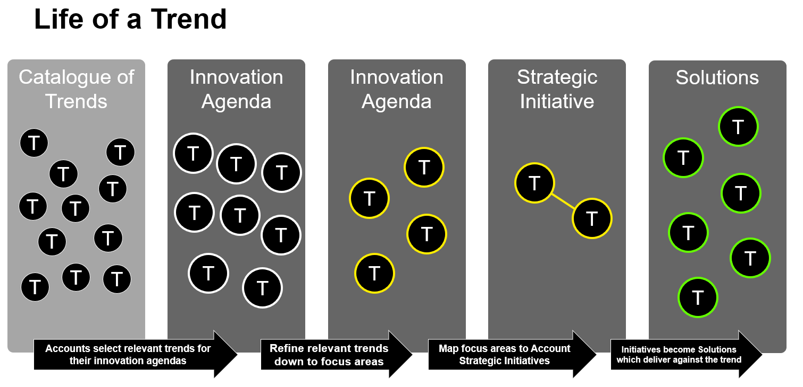 

## Top 10 trends
These represent the selection of a business or technology trend referenced within a client innovation agenda. 
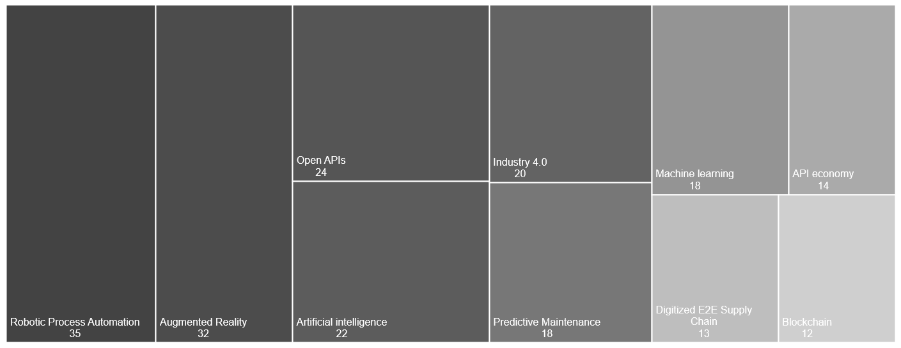 

## Top 10 focus areas
These represent the selection of a business or technology trends referenced within a client innovation agenda which have been identified by the account as a focus area for the next 6-12 months 
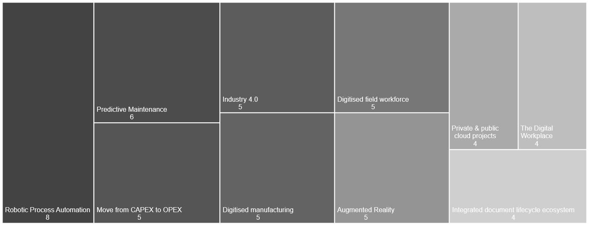 

## Top 10 Strategic Trends
Focus areas pulled into committed Account & Client Strategic Initiatives (i.e. entries within SFDC) 
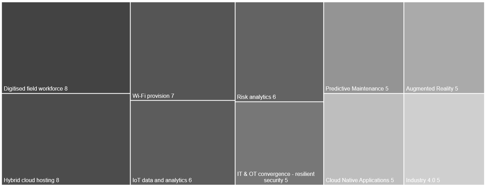 

## Clusters within Strategic Programs
Within the Strategic Initiatives we can identify patterns of common groups or clusters of trends 

### Cluster 1

|Trends|Graph View|
|---|---|
|end-to-end digitised business processes digitised field workforce managing permit to work enforcement management of asset integrity geo-services digitisation of oil fields and facilities geo-fencing|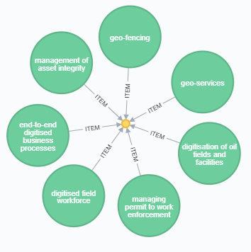

### Cluster 2
|Trends|Graph View|
|---|---|
|blockchain end-to-end value chain oversight intelligent sensors across the value chain it & ot convergence digitised field workforce seismic modelling and analytics robotic process automation iot data and analytics distributed mesh computing accelerate the geology & geophysics modelling lifecycle end-to-end digitised business processes it & ot convergence - resilient security digitisation of oil fields and facilities api economy|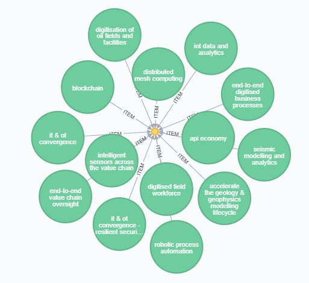

### Cluster 3
|Trends|Graph View|
|---|---|
|end-to-end digitised business processes digitised field workforce managing permit to work enforcement management of asset integrity geo-services digitisation of oil fields and facilities geo-fencing |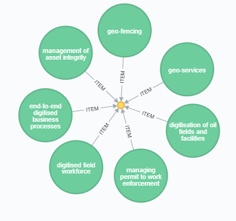

### Cluster 4
|Trends|Graph View|
|---|---|
|digitised manufacturing optimization and virtualisation asset visibility and remote monitoring industry 4.0 
embracing digitisation in products and services it & ot convergence - resilient security small form-factor iot devices wi-fi provision iot data and analytics predictive maintenance |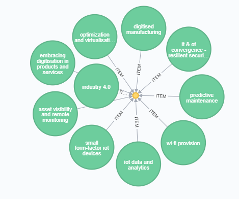

### Cluster 5
|Trends|Graph View|
|---|---|
|real-time analytics location and people-aware evacuation and incident response it & ot convergence - improve operations and safety managing permit to work enforcement distributed mesh computing iot data and analytics digitised field workforce geo-services maximising production without compromising safety geo-fencing automated operational risk management predictive safety alerts |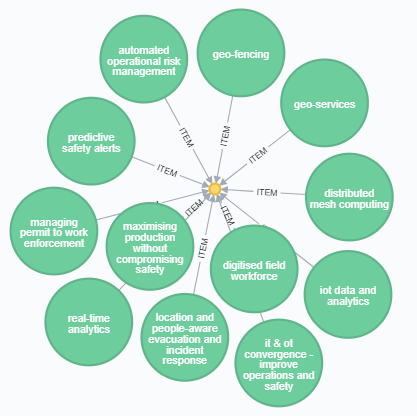

### Cluster 6
|Trends|Graph View|
|---|---|
|predictive maintenance iot security it & ot convergence - improve operations and safety digitised field workforce it & ot convergence iot data and analytics digitisation of oil fields and facilities it & ot convergence - resilient security |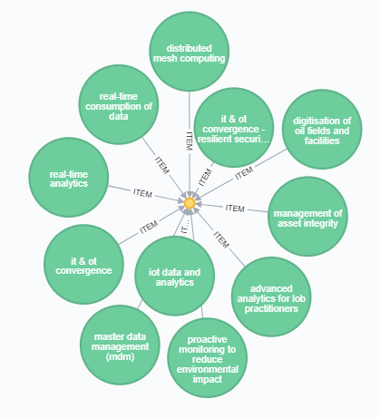

### Cluster 7
|Trends|Graph View|
|---|---|
|iot data and analytics advanced analytics for lob practitioners visual analytics advanced analytics predictive maintenance digitised manufacturing embracing digitisation in products and services |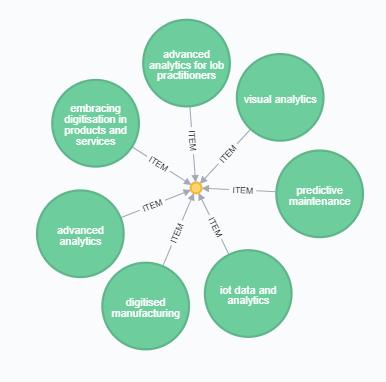

### Cluster 8

|Trends|Graph View|
|---|---|
|optimization and virtualisation digitised manufacturing wi-fi provision asset visibility and remote monitoring iot data and analytics it & ot convergence - resilient security small form-factor iot devices embracing digitisation in products and services industry 4.0 predictive maintenance new build iot|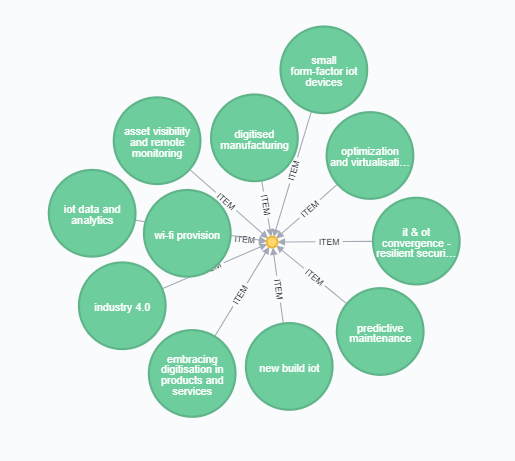

### Cluster 9

|Trends|Graph View|
|---|---|
|self-service it support mobile online collaboration integrated document lifecycle ecosystem employee app stores byod wi-fi provision mobile apps (b2e) & employee expectations e.g. millennials cyod collaboration platforms the digital workplace virtual reality |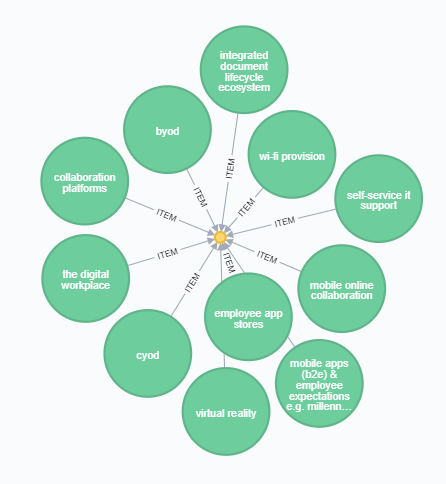

### Sample of descriptions from of Strategic Programs

## Top trends within delivered Solutions
These represent the business or technology trends referenced within documented DXC Solutions
