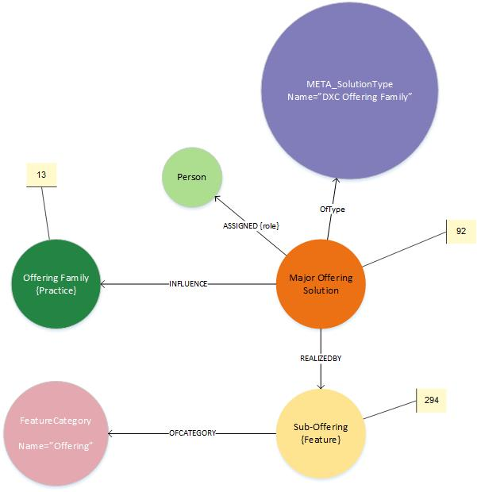
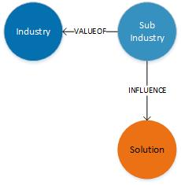
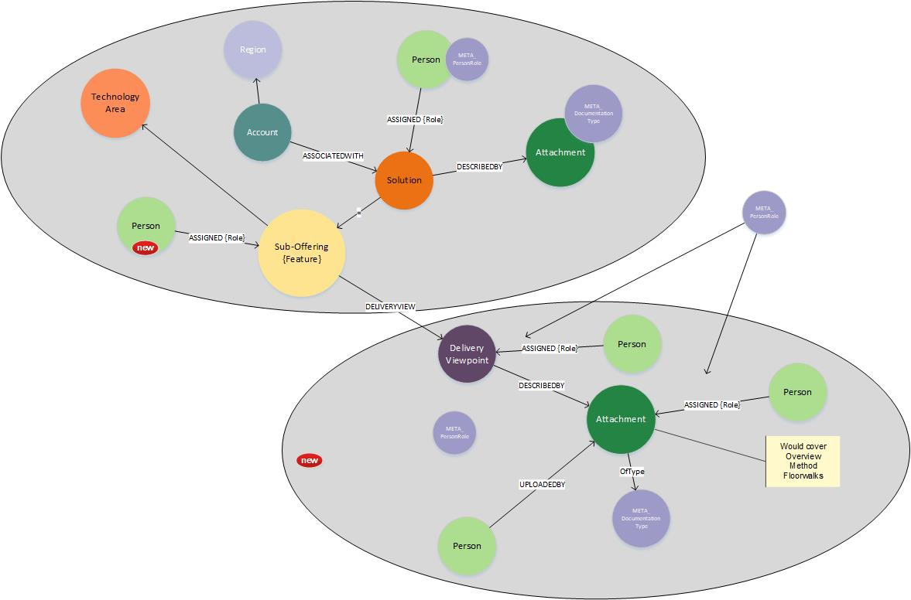
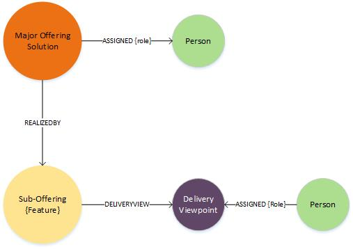

# Key framing datamodel

**the offering and industry reference data shapes the navigator**

## DXC Offerings and Products

- [Master Reference](https://my.dxc.com/our-company/global-functions/integrated-workforce-management/infrastructure-and-support/knowledge-management/km_taxonomy_classification.html)

### Offering Family > Major Offering > Sub Offering

#### DE Model

- From this dataset the initial page and entry points are defined.   Solutions must reference the correct sub-offering to be included within all following viewpoints
- Action : Dave to ensure dataset is complete within Digital Explorer (Dev and Prod)

### DXC industry

### Industry > Sub Industry

#### DE Model

### Delivery Explorer model extensions

# Sub Offering Viewpoints

## Overview
**Delivery Explorer view**
- R1 hard code
- R2 New extensions to the DE Graph Model, incs associated API's
- R2 DelExplorer team to develop dedicated delivery viewpoint capture UI

## Methodology
**Delivery Explorer view**
- R1 hard code
- R2 New extensions to the DE Graph Model, incs associated API's
- R2 DelExplorer team to develop dedicated delivery viewpoint capture UI

## Floor Walks
**Delivery Explorer view**
- R1 hard code
R2 New extensions to the DE Graph Model, incs associated API's
- R2 DelExplorer team to develop dedicated delivery viewpoint capture UI

## Case Studies
**Solution View**
- Group by Account
- List of solutions which include the selected sub offering
- sort by name, rating, industry

## Client Testimonials
**Solution View**
- Attachment type Testimonial doctype text, video or media (new attachment type in meta)

## Connect with Experts

**new query required**

1. pull in from assigned people through "Delivery Viewpoint" Node
2. Deep query into the Graph to return people with more than _x_ solutions using the selected sub-offering

--- 
# Other areas to review
- dataset limited to reference only?
- dataset limited by dedicated tag?   Delivery Team use the tag as a quality review method
- dataset limited by tag and reference values?
