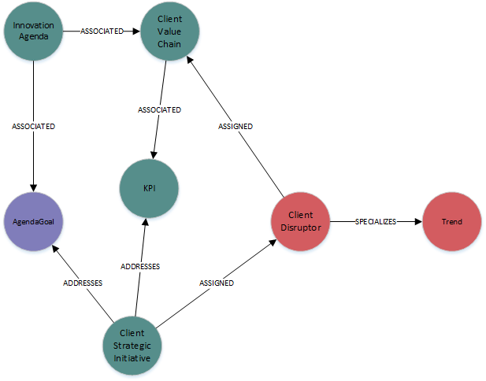

####**Node Definitions**

#####Node Label: Account

|Property|default value (if any)|
|----|----|
|id|system generated
|Name |

#####Node Label: InnovationAgenda

|Property|default value (if any)|
|----|----|
|id|system generated
|text|
|description|
|creationDate|
|validUntil

#####Node Label: ClientValueChain

|Property|default value (if any)|
|----|----|
|id|system generated
|Name|
|docType|
|type|MEDIA
|uri|

#####Node Label: AgendaGoal

|Property|default value (if any)|
|----|----|
|id|system generated
|Name|
|Description|

#####Node Label: KPI

|Property|default value (if any)|
|----|----|
|id|system generated
|Name|
|Measure|

#####Node Label: Stakeholder

|Property|default value (if any)|
|----|----|
|id|system generated
|Name|
|email|

#####Node Label: ClientDisruptor

|Property|default value (if any)|
|----|----|
|id|system generated
|Name|
|description|
|businessArea|
|segment|
|trendType|
|innovationLevel
|focusArea|False

#####Node Label: ClientStrategicInitative

|Property|default value (if any)|
|----|----|
|id|system generated
|Name|
|creationDate|
|modifiedDate|
|description|
|SFDCID|

####Relationships

|Source|Destination|Name|Properties|
|----|----|----|----|
|Account|InnovationAgenda|ASSOICATED
|InnovationAgenda|ClientValueChain|ASSOICATED
|InnovationAgenda|AgendaGoal|ASSOICATED
|Person|Account|ASSIGNED|{role}
|Account|Region|ASSIGNED
|Account|SubIndustry|ACCOUNT_TO_SUBINDUSTRY
|Stakeholder|InnovationAgenda|ASSIGNED
|Stakeholder|ClientValueChain|ASSIGNED
|ClientValueChain|KPI|ASSOICATED
|ClientDisruptor|ClientValueChain|DISRUPTORS
|ClientDisruptor|BusinessTrend|SPECIALIZES
|ClientDisruptor|TechnologyTrend|SPECIALIZES