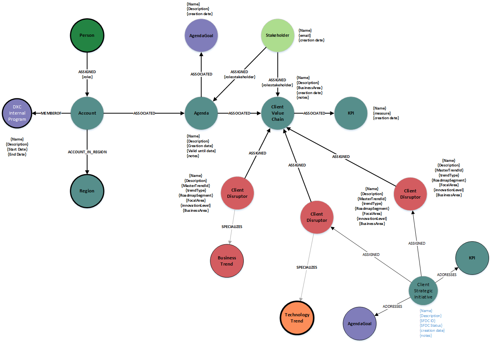

#### **Node Definitions**

##### Node Label: Account

|Property|Description|
|----|----|
|id|system generated
|name | Name of the Account **Required**

##### Node Label: InnovationAgenda

|Property|Description|
|----|----|
|id|system generated
|text| Short name of the agenda **Required**
|description| extended description of the innovation agenda **Required**
|creationDate| system generated - creation date of the agenda **Required**
|validUntil| user input - valid until date **Required**

##### Node Label: ClientValueChain

|Property|Description|
|----|----|
|id|system generated
|name| Name of the client value chain **Required**
|Description| extended description of the client value chain
|businessArea| pick-list - assoicated business area from the DE trend model
|notes | free text to add notes

##### Node Label: AgendaGoal

|Property|Description|
|----|----|
|id|system generated
|name|short text of the business goal
|Description| extended description of the business goal

##### Node Label: KPI

|Property|Description|
|----|----|
|id|system generated
|name|short description of the KPI
|measure|assoicated measure for the KPI

##### Node Label: Stakeholder

|Property|Description|
|----|----|
|id|system generated
|name| name of the stakeholder
|email| email address of the stakeholder

##### Node Label: ClientDisruptor

Specialized instance of the business or technology trend within the innovation agenda

|Property|Description|
|----|----|
|id|system generated
|Name|short description of the disruptor, can be changed
|description|extended description of the disruptor, can be changed
|businessArea|picklist - defines the business area this disruptor is impacting
|segment|location within the agenda Q1-Y3+
|trendType|system generate for catalog trends, picklist for signalss - reference to the type of disruptor BUSINESS or TECHNOLOGY
|innovationLevel|picklist - defines the innovation level assoicated to this disruptor and the client
|focusArea|flag to set the value if the disruptor becomes a focus area for the account team

##### Node Label: ClientStrategicInitative
Outcome of the innovation agenda, selected focus areas are combined to create a new strategic initative

|Property|Description|
|----|----|
|id|system generated
|Name|short name of the client strategic initative
|creationDate|system generated creation date
|modifiedDate|system generated last modified date
|description| extended description of the 
|SFDCID| free text to capture the SFDC id

#### Relationships

|Source|Destination|Name|Properties|
|----|----|----|----|
|Account|InnovationAgenda|ASSOICATED
|InnovationAgenda|ClientValueChain|ASSOICATED
|InnovationAgenda|AgendaGoal|ASSOICATED
|Person|Account|ASSIGNED|{role}
|Account|Region|ASSIGNED
|Account|SubIndustry|ACCOUNT_TO_SUBINDUSTRY
|Stakeholder|InnovationAgenda|ASSIGNED
|Stakeholder|ClientValueChain|ASSIGNED
|ClientValueChain|KPI|ASSOICATED
|ClientDisruptor|ClientValueChain|DISRUPTORS
|ClientDisruptor|BusinessTrend|SPECIALIZES
|ClientDisruptor|TechnologyTrend|SPECIALIZES
|ClientStrategicInitative|ClientDistruptor|ASSIGNED
|ClientStrategicInitative|KPI|ADDRESSES
|ClientStrategicInitative|AgendaGoal|ADDRESSES