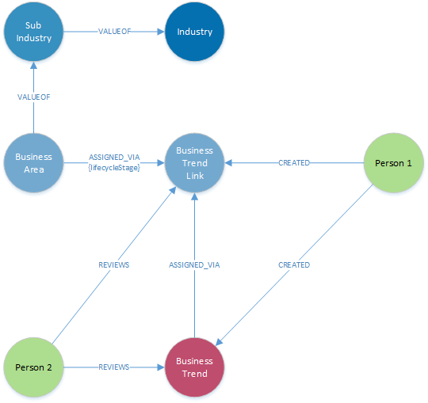

####**Node Definitions**

#####Node Label: BusinessTrend

|Property|default value (if any)|
|----|----|
|id|system generated
|Name |
|Description  
|Source
|Reference

#####Node Label: BusinessTrendLink

|Property|default value (if any)|
|----|----|
|id|system generated
|Description  

#####Node Label: BusinessArea

|Property|default value (if any)|
|----|----|
|id|system generated
|Name|
|Description  

#####Node Label: SubIndustry

|Property|default value (if any)|
|----|----|
|id|system generated
|Name|as defined within SFDC
|Description  

#####Node Label: Industry

|Property|default value (if any)|
|----|----|
|id|system generated
|Name|as defined within SFDC
|Description  

#####Node Label: Person

|Property|default value (if any)|
|----|----|
|id|system generated
|Name|as defined in Global Pass
|email|as defined in Global Pass

####Relationships

|Source|Destination|Name|Properties|
|----|----|----|----|
|BusinessTrend|BusinessTrendLink|ASSIGNED_VIA|
|BusinessArea|BusinessTrendLink|ASSIGNED_VIA|lifecycleStage
|BusinessArea|SubIndustry|VALUEOF
|SubIndustry|Industry|VALUEOF
|Person|BusinessTrend|CREATED
|Person|BusinessTrendLink|CREATED
|Person|BusinessTrend|REVIEWS
|Person|BusinessTrendLink|REVIEWS