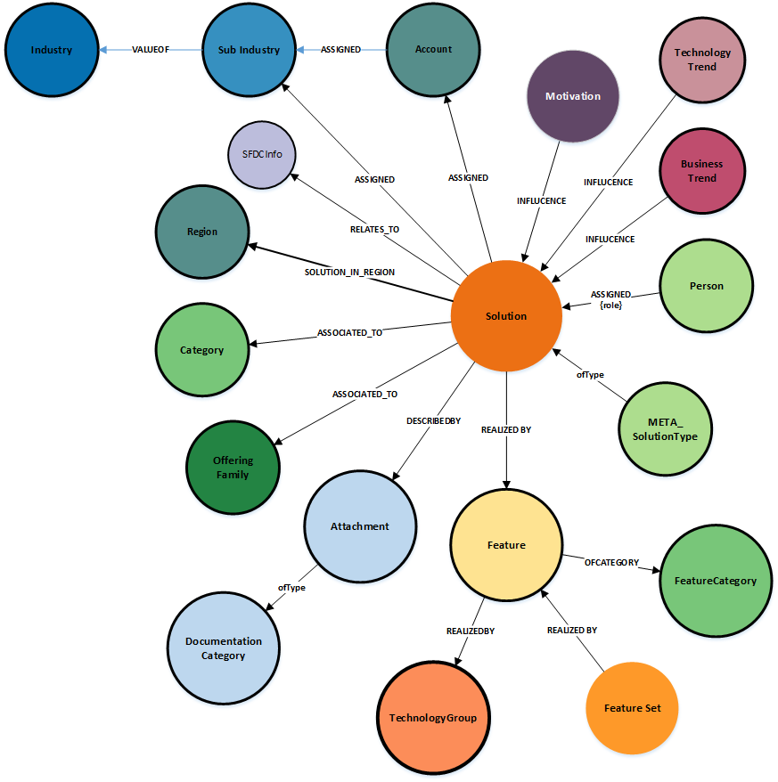

Note : Any nodes with a solid border are a connection point across the graph model 

### **Node Definitions**

#### Node Label: Solution
Scope : Top level object for solutions
Architecture Layer : Business
Ratio : 1

|Property|Description|
|----|----|
|id|system generated
|ObjectClass|Archimate_Product
|Name |
|Description |
|elevatorPitch |
|generalValue |
|creationDate |
|lastModificationDate |
|referenceable|No |
|searchable|Yes |

####Node Label: Motivation
Scope : Key Business drivers and goals
Architecture Layer : Business
Ratio : 1:n

|Property|Description|
|----|----|
|id|system generated
|ObjectClass|Archimate_Driver
|Name |
|Description |

#####Node Label: TechnologyTrend

Scope :  Readonly - selected from trend catalog
Architecture Layer : Business
Ratio : 1:n

|Property|Description|
|----|----|
|id|system generated
|Name |
|Description  

#####Node Label: BusinessTrend
Scope :  Readonly - selected from trend catalog
Architecture Layer : Business
Ratio : 1:n

|Property|Description|
|----|----|
|id|system generated
|Name |
|Description  

##### Node Label: Feature
Scope :  Component or element within the solution
Architecture Layer : Functional 
Ratio : 1:n

|Property|Description|
|----|----|
|id|system generated
|ObjectClass|Archimate_Service
|Name |
|Description  

#### Node Label: FeatureSet
Scope :  Allows grouping of features into logical groups
Architecture Layer : Functional 
Ratio : 1:n

|Property|Description|
|----|----|
|id|system generated
|Name |
|Description  

#### Node Label: Person
Scope : Queried against Person nodes within database - Readonly
Architecture Layer : Business
Ratio : 1:n

|Property|Description|
|----|----|
|id|system generated
|Name|as defined in Global Pass
|email|as defined in Global Pass

#### Node Label: SubIndustry
Scope : identification of target industries (2nd level)
Readonly  - defined within master dictionary 
Architecture Layer : Business
Ratio : 1:n

|Property|Description|
|----|----|
|id|system generated
|Name |
|Description  

#### Node Label: Industry
Scope : identification of target industry (top level)
Readonly - defined within master dictionary 
Architecture Layer : Business
Ratio : 1:n

|Property|Description|
|----|----|
|id|system generated
|Name |
|Description  

#### Node Label: Account
Readonly - defined within master dictionary 
Architecture Layer : Business
Ratio : 1:n

|Property|Description|
|----|----|
|id|system generated
|Name |

#### Node Label: solutionType
Scope : high level definition of the type of solution being described (e.g. demo, partner, client, DXC offering)
Readonly - defined within master dictionary 
Ratio : 1:n

|Property|Description|
|----|----|
|id|system generated
|Name |

#### Node Label: Category
Scope : Allows a solution to be grouped within a logical set of solutions, outside of the organisation or industry views (e.g. data analytics)  
Readonly - defined within master dictionary 
Ratio : 1:n

|Property|Description|
|----|----|
|id|system generated
|Name |

#### Node Label: offeringFamily
Scope : defines the the top level offering families involved within the creation of the solution
Readonly - defined within master dictionary 
Ratio : 1:n

|Property|Description|
|----|----|
|id|system generated
|Name |

#### Node Label: technologyGroup
Scope : defines the placement of the feature within the technical view (e.g application, infra)
Readonly - defined within master dictionary 
Ratio : 1:1

|Property|Description|
|----|----|
|id|system generated
|Name |
|Description  

#### Node Label: FeatureCategory
Scope : defines the type of features (e.g. offering, method, client owned)
Readonly - defined within master dictionary 
Ratio : 1:1

|Property|Description|
|----|----|
|id|system generated
|Name |
|Description  |

#### Node Label: SolutionType
Scope : defines the type of Solution
Readonly - defined within master dictionary 
Ratio : 1:1

|Property|Description|
|----|----|
|id|system generated
|Name |

### Relationships
|Source|Destination|Name|Properties|
|----|----|----|----|
|Motivation|Solution|INFLUENCE
|TechnologyTrend|Solution|INFLUENCE
|BusinessTrend|Solution|INFLUENCE
|Person|Solution|ASSIGNED|{role}
|Solution|Feature|REALIZED_BY
|FeatureSet|Feature|REALIZED_BY
|Feature|FeatureCategory|OFCATEGORY
|Feature|TechnologyGroup|ASSOCIATED_TO
|Solution|OfferingFamily|ASSOCIATED_TO
|Solution|Category|ASSOCIATED_TO
|Solution|SolutionType|OfType
|Solution|Account|ASSIGNED
|Solution|Category|ASSIGNED
|Account|SubIndustry|ASSIGNED
|SubIndustry|Industry|VALUEOF

