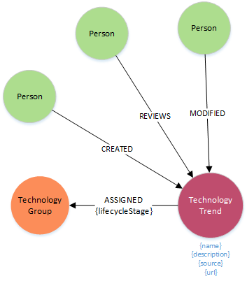

####**Node Definitions**

#####Node Label: TechnologyTrend

|Property|default value (if any)|
|----|----|
|id|system generated
|Name |
|Description  
|Source
|Reference

#####Node Label: TechnologyGroup

|Property|default value (if any)|
|----|----|
|id|system generated
|Name |
|Description  

#####Node Label: Person

|Property|default value (if any)|
|----|----|
|id|system generated
|Name|as defined in Global Pass
|email|as defined in Global Pass

|email|as defined in Global Pass

####Relationships

|Source|Destination|Name|Properties|
|----|----|----|----|
|TechnologyTrend|TechnologyGroup|ASSIGNED|lifecycleStage
|Person|TechnologyTrend|CREATED
|Person|TechnologyTrend|REVIEWS
|Person|TechnologyTrend|MODIFIED