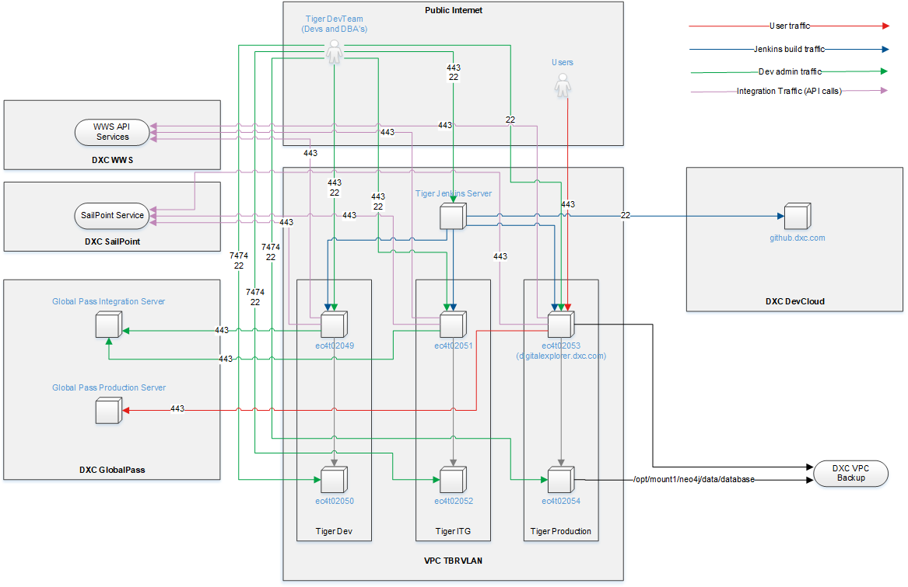

# Digital Explorer Architecture views

## Highlevel Component view 

|Component|Used for|Link
|---|---|---|
|tomcat|frontend web server| http://tomcat.apache.org/ 
|Angular.js|frontend rendering|https://angularjs.org/ 
|d3.js|data visualization|https://d3js.org/ 
|particles.js|background visualizations| https://github.com/VincentGarreau/particles.js
|ngx-markdown|markdown rendering on frontend|https://github.com/jfcere/ngx-markdown
|iTextPDF| PDF rendering and exports|https://itextpdf.com/
|Wordnet|NLP and similarity searching|https://wordnet.princeton.edu/ 
|Springdata|data integration|http://projects.spring.io/spring-data/
|neo4j|backend data|https://neo4j.com

---

## Technical views

### Network diagram

#### Ports

|Source Server|Target Server|Port|Application|
|---|---|---|---|---|
|Dev team|Frontend Development|443|web access|
|Dev team|Frontend Development|22|ssh access|
|Dev team|Backend Development|22|web access|
|Dev team|Backend Development|7474|neo4j access|
|Dev team|Frontend ITG|443|web access|
|Dev team|Frontend ITG|22|ssh access|
|Dev team|Backend ITG|22|web access|
|Dev team|Backend ITG|7474|neo4j access|
|General Users|Frontend ITG|443|web access|
|Dev team|Frontend ITG|22|ssh access|
|Dev team|Backend ITG|22|web access|
|Dev team|Backend ITG|7474|neo4j access|
|Frontend Development Server|Global Pass dev instance|443|Global Pass authentication|
|Frontend ITG Server|Global Pass dev instance|443|Global Pass authentication|
|Frontend Production Server|Global Pass production instance|443|Global Pass authentication|
|Frontend Development Server|WWS API|443|WWS Data Sync|
|Frontend ITG Server|WWS API|443|WWS Data Sync|
|Frontend Production Server|WWS API|443|WWS Data Sync|
|Frontend Development Server|SailPoint API|443|SailPoint Data Sync|
|Frontend ITG Server|SailPoint API|443|SailPoint Data Sync|
|Frontend Production Server|WWSailPointS API|443|SailPoint Data Sync|
|Jenkins build server|github.dxc.com|22|build requests|
|dev team|Jenkins build server|443|Jenkins admin|

### Development and Integration

### Production

