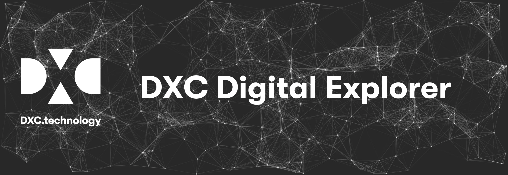

## DXC DigitalExplorer 

DXC Digital Explorer is an Enterprise knowledge graph to understand, shape and enable Digital Transformation
1.	Understand, the needs of  clients through Trends & Roadmaps
    - Providing Industry views of business and technology trends which help frame conversations with our clients
    - Roadmaps drive the client towards the right goal
        - Providing a structure approach to understand the relevant trend/enabler and the risk level associated to the client
        - Provides outside-in information which must be used to influence the offering IRBs and partner conversations
2.	Shows evidence of our integrated solutions across build, sell and delivery through the Solutions module.
    - Solutions can include both internal and partner capabilities
    - Solutions defined by “type” = Labs, delivery, showcases, prototypes, compound solutions.
3.	The graph highlights the skills and the potential of people (for free)
    - trend spotters
    - lead solutioners

DXC Digital Explorer is not a data lake, DXC Digital Explorer is a living dataset.  The knowledge is used from within graph to shape the other DXC Digital Explorer modules. 

* [DXC Digital Explorer 2 slide primer](https://github.com/dxc-technology/dxc-digitalexplorer/blob/master/SongSheet/readme.md)
* [Introduction Presentation](https://github.com/dxc-technology/dxc-digitalexplorer/blob/master/Presentations/DXC%20Digital%20Explorer.Overview.ShortVersion.pptx)
* [DXC Digital Explorer key features](https://github.com/dxc-technology/dxc-digitalexplorer/blob/master/deFeatures.md)
* [DXC Digital Explorer Achievements](https://github.com/dxc-technology/dxc-digitalexplorer/blob/master/Achievements.md)
* [Release Notes](https://github.com/dxc-technology/dxc-digitalexplorer/blob/master/ReleaseNotes)
* [Contributing to Digital Explorer](https://github.com/dxc-technology/dxc-digitalexplorer/blob/master/contributing.md)
* [F.A.Q.](https://github.com/dxc-technology/dxc-digitalexplorer/blob/master/SongSheet/faq.md)

### :books: Meta Models
* [Complete Model](https://github.com/dxc-technology/dxc-digitalexplorer/blob/master/MetaModels/completeModel.md)
* [Business Trends MetaModel](https://github.com/dxc-technology/dxc-digitalexplorer/blob/master/MetaModels/BusinessTrendMetaModel.md)
* [Technology Trends Metamodel](https://github.com/dxc-technology/dxc-digitalexplorer/blob/master/MetaModels/TechnologyTrendMetaModel.md)
* [Roadmap Metamodel](https://github.com/dxc-technology/dxc-digitalexplorer/blob/master/MetaModels/RoadmapMetaModel.md)
* [Solutions MetaModel](https://github.com/dxc-technology/dxc-digitalexplorer/blob/master/MetaModels/SolutionMetaModel.md)
* [Workspace metamodel](https://github.com/dxc-technology/dxc-digitalexplorer/blob/master/MetaModels/WorkspaceMetaModel.md)

### :trophy: Awards
* [Neo4j Graph Impact award 2018 for Digital Transformation](https://neo4j.com/news/2018-graphie-award-winners/)

### :busts_in_silhouette: Contacts

* Product Owner/Architect : David Stevens (davidstevens@dxc.com)

---

### Internal only

* [DE Mind Map](internalContent/deMindMap.md)
* [Taxonomy](internalContent/Taxonomy/readme.md)
* [Weekly Numbers](internalContent/WeeklyNumbers.md)
* [RFP response text](internalContent/rfp_DigitalExplorer_response.md)
* [Content RACI](internalContent/ContentRACI.md)
* [Stakeholders](internalContent/Stakeholders.md)
* [Regional Leads](internalContent/regionalLeads.md)
* [Graphie award photos](internalContent/GraphieAwards.readme.md)
