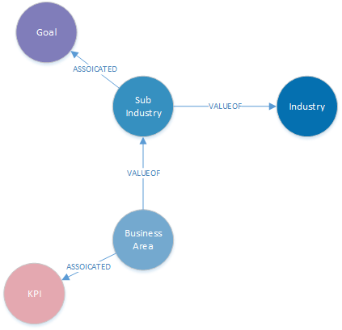
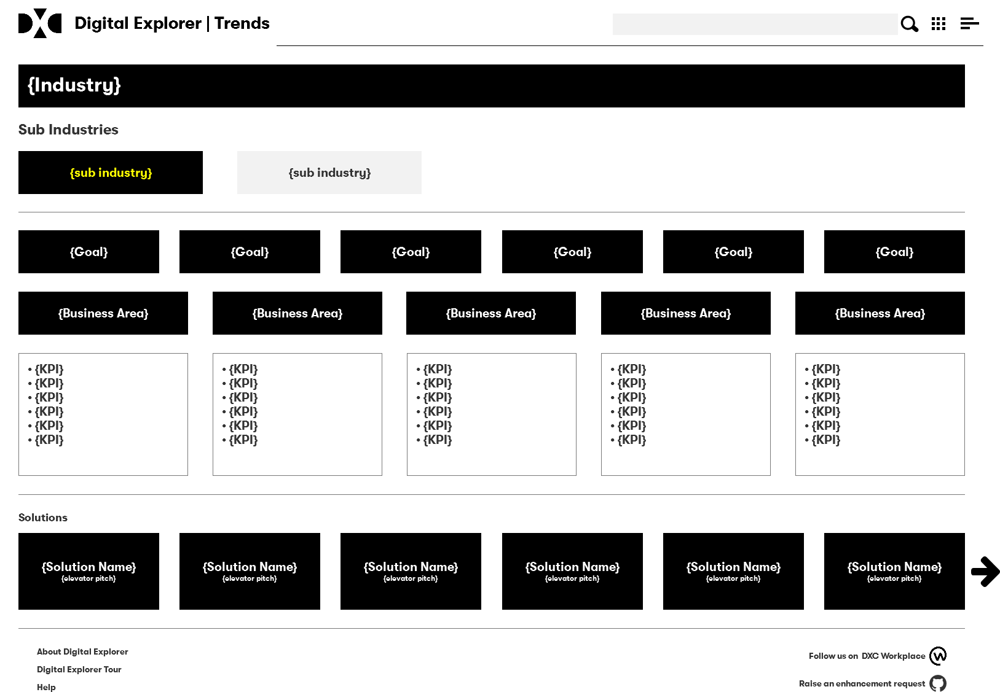

# Business Value Frameworks

## How close is DE to the BVF model?

## Model alignment

- add goals to sub-industry model
- add KPI's to business areas
- allow KM's to view and manage content

 
- goals and KPI can be reused within innovation agenda (starting content for users to keep or remove)

## Trends
- extend model to allow technology as the enabler of the industry trend?

## Solutions 

- use simple tag to call out if solution is industry focused

---

