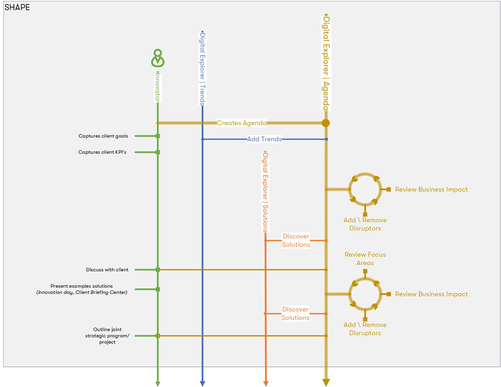

## The Innovation Leader

**typical profile/role**
* Account CT
* Solution Lead
* Industry Leader

## Shape

* Creates innovation agenda
    * leverages homework (Digital Explorer | Workspace, personal notes, github notebook)
    * add trends ~ this are now called client disruptors
    * builds strawman
    * iterates on content with internal team
        * the right disruptors?
        * do we understand the enabling technology?
        * Discovers DXC capabilities
            * demos, prototypes, offerings, existing client solutions
    * reviews/discusses with client
        * iterates on content
        * showcases discovered DXC capabilities
        * calls out joint focus areas
        * outlined joint program/program

### Missing pieces
* Capturing signals
* Joint program = future Solutions entry
* Power of the connected graph - discover more than just library of solutions, discover other similar agendas, workspaces, discussions.
* Machine Learning to find matches