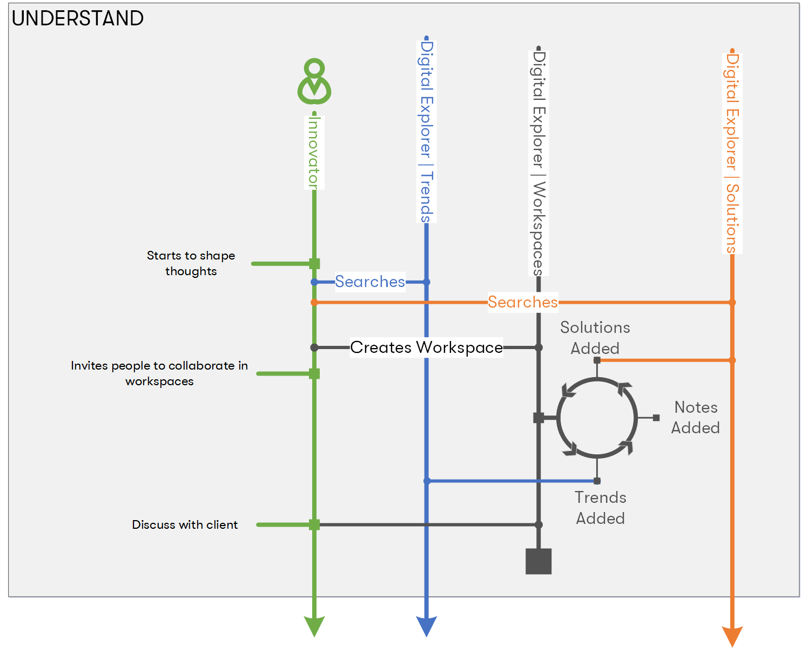

## The Innovation Leader

**typical profile/role**
* Account CT
* Solution Lead
* Industry Leader

### Activities

* Understand
    * Researches client's industry within Digital Explorer | Trends
    * (optional) - creates new team workspace
        * add first trend
        * invites team/colleugaes to worksplace
        * iterate on adding trends, solutions, notes, attachments, views, thoughts

### Missing pieces
* Power of the connected graph - discover more than just library of solutions, discover other similar agendas, workspaces, discussions.
* Machine Learning to find matches
