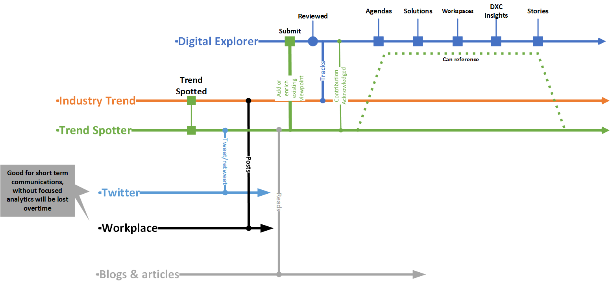

## The Trend Spotter

**Typical profile/role**
* Regional CTO
* Offering CTO
* Industry CTO
* Account CT
* Industry Leader
* AGM
* Account Architect
* Anyone with knowledge/interest

### Activities
* Discovers
    * Reads industry articile\tweet
    * Discusses "thing" with client,collegagues, 3rd parties

* Shares
    * Tweet\Retweets (low effort)
    * Post to workplace groups (low effort)
    * Shares via Digital Explorer (medium effort - need to login to DE)

#### Why post into Digital Explorer?
* Primary
    * Used within client conversations
    * Input for client innovation agendas and roadmaps
    * Support all of DXC engagement teams

* Secondary
    * Presented via DXC branded site - builds strong DXC messaging
    * Allow cross references between industries
    * Builds your profile within the company
        * future tech honours and award programs should (will) review contribution to enterprise knowledge

## Future scenerios
* Route 1 : Digital Explorer integration with Workplace - pre-populates an entry - informs person - revises - informs review board - posts into DE
* Route 2 : Digital Explorer integration with Workplace - pre-populates an entry - informs review board - posts into DE
* Route 3 : Digital Explorer integration with Workplace - pre-populates an entry - posts into DE