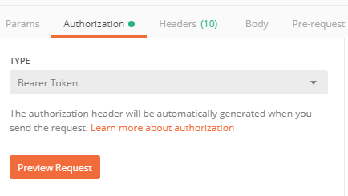
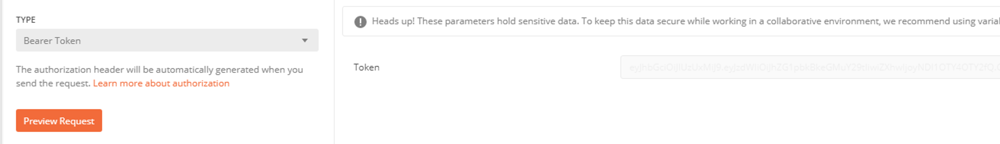
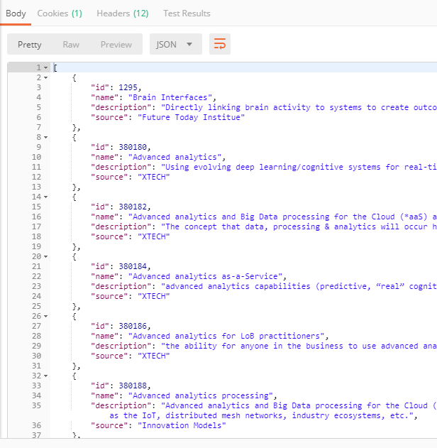

# Digital Explorer API's
## How to use\test

You can test the Digital Explorer API's using the [Postman](https://www.getpostman.com/downloads/) application 

### Testing you first Digital Explorer API
The following example will return all the Digital Explorer technology Trends
 
The api is `wwb/api/trends/technology/all`

1. Load Postman
2. Set the request to `GET` and enter the API URL 
 
3. Set the `Authorization` to `Bearer Token` 
 
4. Enter your Token 
 
5. Hit `Send` 
 
6. The results are returned in the output section 
  

---
## Available DXC internal API's

### Business Trends
- Data restrictions : None

`https://digitalexplorer.dxc.com/wwb/api/trends/business/all`

**Base return URL**

**`https://digitalexplorer.dxc.com/de/stats/business/<id>/dxc-demand-curve`**

~~~
[
  {
    "author": {
      "email": "string",
      "id": 0,
      "lastLoginDate": 0,
      "name": "string",
      "roles": [
        {
          "name": "string"
        }
      ]
    },
    "businessLinks": [
      {
        "author": {
          "email": "string",
          "id": 0,
          "lastLoginDate": 0,
          "name": "string",
          "roles": [
            {
              "name": "string"
            }
          ]
        },
        "businessArea": "string",
        "description": "string",
        "id": 0,
        "industry": "string",
        "lifecycleStage": "string",
        "subIndustry": "string"
      }
    ],
    "createDate": "2019-06-21T07:50:18.623Z",
    "description": "string",
    "id": 0,
    "name": "string",
    "order": 0,
    "reference": "string",
    "source": "string"
  }
]
~~~

### Technology Trends
- Data restrictions : None

`https://digitalexplorer.dxc.com/wwb/api/trends/technology/all`

**Base return URL**

**`https://digitalexplorer.dxc.com/de/stats/technology/<id>/dxc-demand-curve`**

~~~
[
  {
    "author": {
      "email": "string",
      "id": 0,
      "lastLoginDate": 0,
      "name": "string",
      "roles": [
        {
          "name": "string"
        }
      ]
    },
    "createDate": "2019-06-21T07:53:44.648Z",
    "description": "string",
    "id": 0,
    "lifecycleStage": "string",
    "name": "string",
    "order": 0,
    "reference": "string",
    "source": "string",
    "technologyGroup": "string"
  }
]
~~~

### Industries
- Data restrictions : None

`https://digitalexplorer.dxc.com/wwb/api/admin/meta/industries/hierarchy`

~~~
[
  {
    "name": "string",
    "subIndustries": [
      {
        "businessAreas": [
          {
            "description": "string",
            "name": "string",
            "order": 0
          }
        ],
        "name": "string"
      }
    ]
  }
]
~~~

### Solutions
- Data restrictions : Searchable solutions

**Parameters**

|Parameter|Description|Type|Example|
|---|---|---|---|
|`limit` |number of solutions returned per page|integer|`limit=100`
|`modifyTimeFrom` |last modify date filter starting date value (java long date) |integer($int64)|`modifyTimeFrom=
|`modifyTimeTo` |last modify date filter end date value  (java long date)  |integer($int64)
|`createTimeFrom` |creation date filter starting date value (java long date)  |integer($int64)
|`createTimeTo` |creation date filter end date value (java long date)  |integer($int64)

`https://digitalexplorer.dxc.com/wwb/api/search?limit=10&order=DEFAULT&skip=0&type=ALL`

**Base return URL**

**`https://digitalexplorer.dxc.com/se/solutions/<id>`**

~~~
{
  "count": 0,
  "effectiveFilterValues": {
    "categories": [
      "string"
    ],
    "industries": [
      "string"
    ],
    "practices": [
      "string"
    ],
    "referenceables": [
      "string"
    ],
    "solutionTypes": [
      "string"
    ],
    "statuses": [
      "string"
    ],
    "tags": [
      "string"
    ]
  },
  "keyWords": "string",
  "limit": 0,
  "queryTime": 0,
  "results": {},
  "skip": 0
}
~~~

### Playbooks

- Data restrictions : Only public playbooks

`https://digitalexplorer.dxc.com/wwb/api/playbook?withoutPrivate=false`

~~~

~~~

**Base return URL**

**`https://digitalexplorer.dxc.com/pb/playbook/<id>`**
