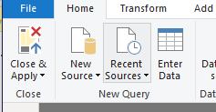
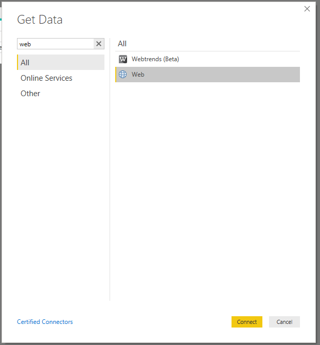
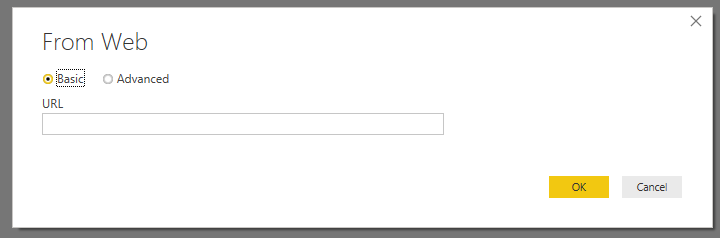
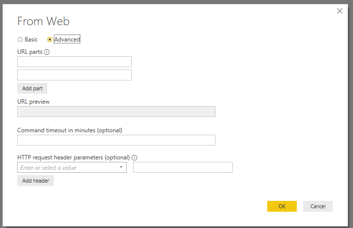
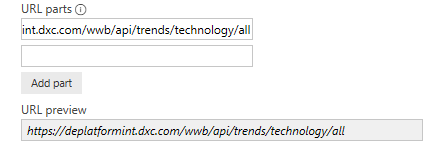
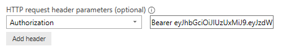

# :construction:

# Connecting to Digital Explorer via PowerBI

Once you have your access token you can connect to the Digital Explorer Dataset via PowerBI

## Connecting to a DE API

1. Open the PowerBI application
2. Select `New Source` 
 
3. Select `Web` 
 
4. Select `Advanced` 
 
 
5. Enter the URL for the API in the `URL Parts` 
 
6. Select `Authorization` in the `request header parameters` 
 
7. Add  `Bearer <your token>` in the available field
**Note the uppercase B, the prefix should be Bearer**
8. Select `OK`

PowerBI will now connect to the API

---

## Building your first dashboard
How to build a dashboard to show a heatmap of the top trends referenced within the innovation agendas. 

The associated API is : wwb/api/agenda/insights 

Production URL https://digitalexplorer.dxc.com

For integration testing the URL is https://deplatformint.dxc.com/

1. Add a new data source as described above
2. transformations
   1. Convert into table
   2. Expanded Column1 
   3. set numeric values to numeric - default is string
3. Once connected save `Close and Apply`

---

## Issues

If you receive this error

 

You will need to clear the local cache of your PowerBI desktop.

File > Options and Settings > Options > Data Load > Clear Cache
