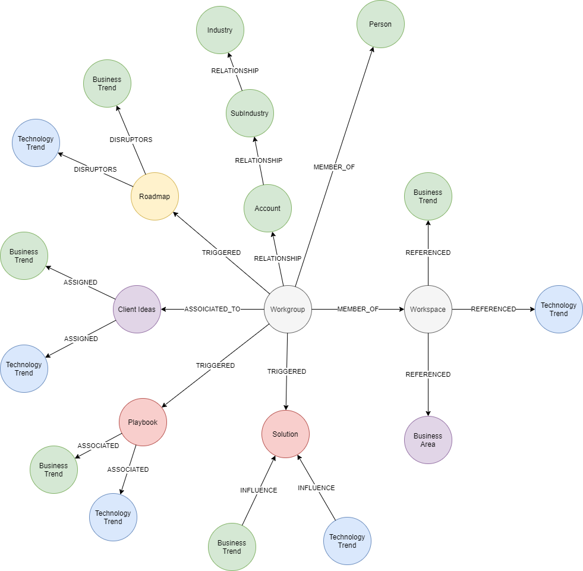

## Workgroup Model

Consists of 7 API's

`/api/reporting/workgroupMetric/...`

- `GetWorkgroupDetails`
- `GetWorkspaceDetails`
- `GetWorkspaceContent`
- `GetWorkspaceIdeas`
- `GetWorkspaceRoadmaps`
- `GetWorkspacePlaybooks`
- `GetWorkspaceSolutions`

### Parameters
- None

### Pre-requisites 
- None

### Data Model

 

### Neo4j Queries

#### GetWorkgroupDetails

~~~
MATCH (wsg:WorkspaceGroup)<-[:MEMBER_OF]-(p:Person)
OPTIONAL MATCH (wsg)-[:ASSIGNED]->(a:Account)-[:ACCOUNT_TO_SUBINDUSTRY]->(si:SubIndustry)-[:VALUEOF]->(i:Industry)
RETURN 
    id(wsg) as workgroupID,
    wsg.name as workgroupName, 
    p.name as personName, 
    p.email as personEmail,
    a.name as accountName, 
    si.name as subIndustryName,
    i.name as industryName
~~~

#### GetWorkspaceDetails

~~~
MATCH (wsg:WorkspaceGroup)<-[:MEMBER_OF]-(ws:Workspace)
RETURN
  	id(wsg) as workgroupID,
    wsg.name as workgroupName,
    id(ws) as workspaceID,
	ws.name as workspaceName
~~~

#### GetWorkspaceContent

~~~
match (ws:Workspace)<-[:INCLUDES]-(a:Attachment)-[r:REFERENCED]->(c)
return 
id(ws) as workspaceID,
ws.name as workspaceName,
labels(c) as item,
c.name as itemname,
sum(r.occurrence) as Count
~~~

#### GetWorkspaceIdeas

~~~
match (wsg:WorkspaceGroup)<-[:ASSOCIATED_TO]-(ci:ClientIdea)-[:ASSIGNED]->(t:ClientDisruptor)
return 
	id(wsg) as workgroupID,
    wsg.name as workgroupName, 
    ci.name as ClientideaName,
    t.name as trendName
~~~

#### GetWorkspaceRoadmaps

~~~
match (wsg:WorkspaceGroup)-[:TRIGGERED]->(ia:InnovationAgenda)-[:PROGRAMS]->(cvc:ClientValueChain)<-[:DISRUPTORS]-(t:ClientDisruptor)
return
    id(wsg) as workgroupID,
    wsg.name as workgroupName, 
    ia.name as RoadmapName,
    t.name as trendName
~~~

#### GetWorkspacePlaybooks

~~~
match (wsg:WorkspaceGroup)-[:TRIGGERED]->(pb:Playbook)
optional match (pb)-[:ASSOCIATED]->(t:BusinessTrend)
return
  id(wsg) as workgroupID,
    wsg.name as workgroupName, 
    pb.title as playbookName,
    t.name as trendName
union
match (wsg:WorkspaceGroup)-[:TRIGGERED]->(pb:Playbook)
optional match (pb)-[:ASSOCIATED]->(t:TechnologyTrend)
return
  id(wsg) as workgroupID,
    wsg.name as workgroupName, 
    pb.title as playbookName,
    t.name as trendName
~~~

#### GetWorkspaceSolutions

~~~
match (wsg:WorkspaceGroup)-[:TRIGGERED]->(s:Solution)
optional match (s)<-[:INFLUENCE]-(t:BusinessTrend)
return
    id(wsg) as workgroupID,
    wsg.name as workgroupName, 
    s.name as solutionName,
    t.name as trendName
union
match (wsg:WorkspaceGroup)-[:TRIGGERED]->(s:Solution)
optional match (s)<-[:INFLUENCE]-(t:TechnologyTrend)
return 
  	id(wsg) as workgroupID,
    wsg.name as workgroupName, 
    s.name as solutionName,
    t.name as trendName
~~~