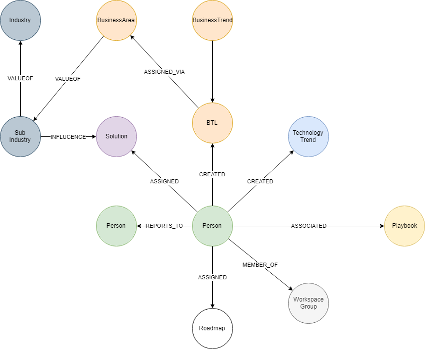

## Contribution API

## API's
Each branch of the data model is a separate API call; ensuring the load on the system is too high and enabling further data modelling/enrichment within PowerBI

`/api/reporting/....`

### Parameters
- None

### Pre-requisites 
- None

### Data Model

 

### Neo4j Queries

#### Reporting Lines

~~~
MATCH (p:Person)-[r:REPORTS_TO]->(p2:Person)
WHERE p.employeeStatus="A"
RETURN 
    id(p) as pID, 
    p.name as PersonName, 
    p.email as PersonEmail, 
    p.lastLoginDate as LastLoginDate,
    id(p2) as Reports2ID, 
    p2.name as Reports2Name, 
    p2.email as Reports2Email
~~~

#### Solutions

~~~
MATCH (i:Industry)<-[:VALUEOF]-(si:SubIndustry)-[:INFLUENCE]->(s:Solution)<-[rs:ASSIGNED]-(p:Person {employeeStatus:"A"})
WHERE p.employeeStatus="A"
OPTIONAL match (s:Solution) where s.createdBy=p.email
RETURN 
    id(p) as pID,
	p.name as PersonName,
    p.email as PersonEmail,
    p.lastLoginDate as LastLoginDate,
    s.name as submittedSolutionName,
    s.creationDate as SolutionCreationDate,
    s.lastModificationDate as SolutionModificationDate,
    rs.role as SolutionContact,
    i.name as IndustryName, si.name as SubIndustryName
~~~

#### Business Trends

~~~
MATCH (bt:BusinessTrend)-[:ASSIGNED_VIA]->(btl:BusinessTrendLink)<-[r:CREATED]-(p:Person),
	(btl)<-[:ASSIGNED_VIA]-(ba:BusinessArea)-[:VALUEOF]->(si:SubIndustry)-[:VALUEOF]->(i:Industry)
WHERE p.employeeStatus="A"
RETURN 
    id(p) as pID,
	p.name as PersonName,
    p.email as PersonEmail,
    p.lastLoginDate as LastLoginDate,
    bt.name as BusinessTrendName,
    r.createDate as BusinessTrendCreationDate,
    i.name as IndustryName, si.name as SubIndustryName
~~~

#### Technology Trends

~~~
MATCH (tt:TechnologyTrend)<-[r:CREATED]-(p:Person)
WHERE p.employeeStatus="A"
RETURN 
    id(p) as pID
	p.name as PersonName,
    p.email as PersonEmail,
    p.lastLoginDate as LastLoginDate,
    p.lastLoginDate as LastLoginDate,
    tt.name as TechnologyTrendName,
    r.createDate as TechnologyTrendCreationDate
~~~

#### Innovation Agendas

~~~
MATCH (ia:InnovationAgenda)<-[r:ASSIGNED]-(p:Person)
WHERE p.employeeStatus="A"
RETURN 
    id(p) as pID
	p.name as PersonName,
    p.email as PersonEmail,
    p.lastLoginDate as LastLoginDate,
    p.lastLoginDate as LastLoginDate,
    ia.name as RoadmapName,
    ia.creationDate as RoadmapCreationDate
~~~

#### Workgroups

~~~
MATCH (wsg:WorkspaceGroup)<-[:MEMBER_OF]-(p:Person)
WHERE p.employeeStatus="A"
RETURN 
	id(p) as pID
	p.name as PersonName,
    p.email as PersonEmail,
    p.lastLoginDate as LastLoginDate,
    p.lastLoginDate as LastLoginDate,
    wsg.name as WorkGroupName
~~~

#### Playbooks

~~~
MATCH (pb:Playbook)-[:ASSOCIATED]->(p:Person)
WHERE p.employeeStatus="A"
RETURN
	p.name as name,p.employeeStatus,
    p.lastLoginDate as LastLoginDate,
    pb.title as PlaybookName
UNION
MATCH (pb:Playbook)<-[:CREATED]-(p:Person)
RETURN 
	p.name as name,p.employeeStatus,
    p.lastLoginDate as LastLoginDate,
    pb.title as PlaybookName
~~~

---