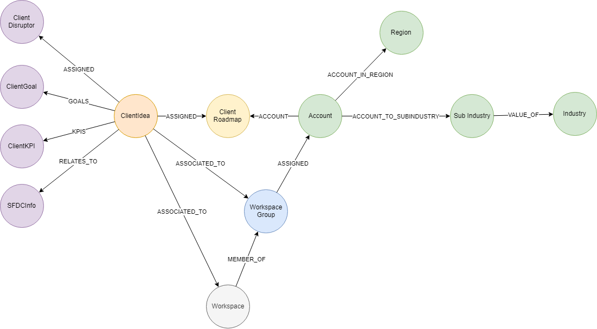

## Customer Ideas

`main#/agenda-controller/getAllClientIdeasUsingGET`

### Parameters
- None

### Pre-requisites 
To include Ideas from Workgroups, the Workgroup must be assigned to one or more accounts.

### Data Model

 

### DataSet

~~~
[
  {
    "account": "string",
    "businessProblem": "string",
    "creationDate": "2020-05-13T12:26:30.700Z",
    "cvcs": [
      "string"
    ],
    "description": "string",
    "discover": 0,
    "discoverCloseDate": "2020-05-13T12:26:30.700Z",
    "disruptors": [
      "string"
    ],
    "goals": [
      "string"
    ],
    "industry": "string",
    "kpis": [
      "string"
    ],
    "name": "string",
    "operation": 0,
    "operationCloseDate": "2020-05-13T12:26:30.700Z",
    "owner": "string",
    "pilot": 0,
    "pilotCloseDate": "2020-05-13T12:26:30.700Z",
    "production": 0,
    "productionCloseDate": "2020-05-13T12:26:30.700Z",
    "prototype": 0,
    "prototypeCloseDate": "2020-05-13T12:26:30.700Z",
    "region": "string",
    "roadmapCreationDate": "2020-05-13T12:26:30.700Z",
    "roadmapName": "string",
    "sfdcInfos": [
      0
    ],
    "status": "string",
    "subIndustry": "string"
  }
]
~~~

### Neo4j Query

~~~
MATCH (ci:ClientIdea)-[:ASSIGNED]->(cd:ClientDisruptor)
  OPTIONAL MATCH (ci)-[:ADDRESSES]->(cg:AgendaGoal) 
  OPTIONAL MATCH (ci)-[:ADDRESSES]->(ckpi:KPI) 
  OPTIONAL MATCH (ci)-[:RELATES_TO]->(sfdc:SFDCInfo)
   with ci,cd,cg,ckpi,sfdc
  //GET THE ASSOICATED ROADMAP AND ACCOUNT INFORMATION (IF IDEA IS LINKED TO A ROADMAP)
  MATCH (ci)-[:ASSIGNED]->(cr:InnovationAgenda)<-[:ACCOUNT]-(a:Account) 
  OPTIONAL MATCH (a)-[:ACCOUNT_IN_REGION]->(r:Region) 
  OPTIONAL MATCH (a)-[:ACCOUNT_TO_SUBINDUSTRY]->(si:SubIndustry)-[:VALUEOF]->(i:Industry) 
  OPTIONAL MATCH (ci)-[rp:ASSIGNED {role:'OWNER'}]->(owner:Person) 
  
RETURN ci.name AS name, ci.description AS description, ci.businessProblem AS problemStatement, ci.status AS status,   owner.email AS assignedLead, ci.creationDate AS creationDate, ci.discover AS discover, ci.prototype AS prototype, ci.pilot AS pilot,ci.production AS production, ci.operation AS operation, ci.discoverCloseDate AS discoverCloseDate, ci.prototypeCloseDate AS prototypeCloseDate, ci.pilotCloseDate AS pilotCloseDate, ci.productionCloseDate AS productionCloseDate, ci.operationCloseDate AS operationCloseDate, COLLECT(ID(sfdc)) AS sfdcInfos, COLLECT(cg.name) AS goals, COLLECT(ckpi.name) AS kpis, COLLECT(cd.name) AS disruptors, i.name AS industry, si.name AS subIndustry, a.name AS account, r.name AS region, cr.name AS roadmapName, cr.creationDate AS roadmapCreationDate
  
  UNION
  //IDEAS WITHIN WORKGROUPS
  MATCH (ci:ClientIdea)-[:ASSIGNED]->(cd:ClientDisruptor)
  OPTIONAL MATCH (ci)-[:ADDRESSES]->(cg:AgendaGoal) 
  OPTIONAL MATCH (ci)-[:ADDRESSES]->(ckpi:KPI) 
  OPTIONAL MATCH (ci)-[:RELATES_TO]->(sfdc:SFDCInfo)
  WITH ci,cd,cg,ckpi,sfdc  //GET THE ASSOICATED WORKGROUP AND ACCOUNT (IF THE IDEA IS LINKED TO A WORKGROUP)
  MATCH (ci)-[:ASSOCIATED_TO]->(cr:WorkspaceGroup)-[:ASSIGNED]->(a:Account)
  OPTIONAL MATCH (a)-[:ACCOUNT_IN_REGION]->(r:Region) 
  OPTIONAL MATCH (a)-[:ACCOUNT_TO_SUBINDUSTRY]->(si:SubIndustry)-[:VALUEOF]->(i:Industry) 
  OPTIONAL MATCH (ci)-[rp:ASSIGNED {role:'OWNER'}]->(owner:Person) 
  
RETURN ci.name AS name, ci.description AS description, ci.businessProblem AS problemStatement, ci.status AS status,   owner.email AS assignedLead, ci.creationDate AS creationDate, ci.discover AS discover, ci.prototype AS prototype, ci.pilot AS pilot,ci.production AS production, ci.operation AS operation, ci.discoverCloseDate AS discoverCloseDate, ci.prototypeCloseDate AS prototypeCloseDate, ci.pilotCloseDate AS pilotCloseDate, ci.productionCloseDate AS productionCloseDate, ci.operationCloseDate AS operationCloseDate, COLLECT(ID(sfdc)) AS sfdcInfos, COLLECT(cg.name) AS goals, COLLECT(ckpi.name) AS kpis, COLLECT(cd.name) AS disruptors, i.name AS industry, si.name AS subIndustry, a.name AS account, r.name AS region, cr.name AS roadmapName, cr.creationDate AS roadmapCreationDate

UNION 
//IDEAS FROM WORKSPACES
  MATCH (ci:ClientIdea)-[:ASSIGNED]->(cd:ClientDisruptor)
  OPTIONAL MATCH (ci)-[:ADDRESSES]->(cg:AgendaGoal) 
  OPTIONAL MATCH (ci)-[:ADDRESSES]->(ckpi:KPI)  
  OPTIONAL MATCH (ci)-[:RELATES_TO]->(sfdc:SFDCInfo)
  WITH ci,cd,cg,ckpi,sfdc
  
  //GET THE ASSOICATED  ACCOUNT (IF THE IDEA IS LINKED TO A WORKSPACE)
  MATCH (ci)-[:ASSOCIATED_TO]->(ws:Workspace)-[:MEMBER_OF]->(cr:WorkspaceGroup)-[:ASSIGNED]->(a:Account)
    OPTIONAL MATCH (a)-[:ACCOUNT_IN_REGION]->(r:Region) 
  OPTIONAL MATCH (a)-[:ACCOUNT_TO_SUBINDUSTRY]->(si:SubIndustry)-[:VALUEOF]->(i:Industry) 
  OPTIONAL MATCH (ci)-[rp:ASSIGNED {role:'OWNER'}]->(owner:Person) 
  
RETURN ci.name AS name, ci.description AS description, ci.businessProblem AS problemStatement, ci.status AS status,   owner.email AS assignedLead, ci.creationDate AS creationDate, ci.discover AS discover, ci.prototype AS prototype, ci.pilot AS pilot,ci.production AS production, ci.operation AS operation, ci.discoverCloseDate AS discoverCloseDate, ci.prototypeCloseDate AS prototypeCloseDate, ci.pilotCloseDate AS pilotCloseDate, ci.productionCloseDate AS productionCloseDate, ci.operationCloseDate AS operationCloseDate, COLLECT(ID(sfdc)) AS sfdcInfos, COLLECT(cg.name) AS goals, COLLECT(ckpi.name) AS kpis, COLLECT(cd.name) AS disruptors, i.name AS industry, si.name AS subIndustry, a.name AS account, r.name AS region, cr.name AS roadmapName, cr.creationDate AS roadmapCreationDate
~~~

---

