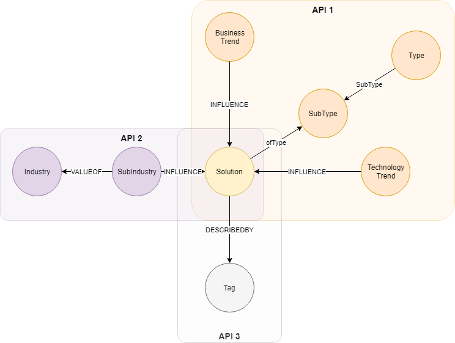

## Solution Model

Consists of 3 API's

## Solution, Type and Trends

`main#/solution-controller/getAllSolutionTrendsGET`

## Solution and Industries

`main#/solution-controller/getAllSolutionIndustriesGET`

## Solution and Tags

`main#/solution-controller/getAllSolutionTagsGET`

### Parameters
- None

### Data Model

 

### Pre-requisites 
- None

### Neo4j Queries

#### Solution Type and Trends
~~~
//SOLUTION TRENDS
//*****************
//BUSINESS TRENDS
MATCH (s:Solution)-[:ofType]->(sst:SolutionSubType)<-[:SubType]-(st:SolutionType)
OPTIONAL MATCH (s)<-[:INFLUENCE]-(bt:BusinessTrend)
RETURN DISTINCT id(s)as ID, s.name as SolutionName, s.status as SolutionStatus,s.elevatorPitch as SolutionPitch,sst.name as SolutionSubType, st.name as SolutionType, COLLECT (bt.name) as TrendName
UNION
//TECHNOLOGY TRENDS
MATCH (s:Solution)-[:ofType]->(sst:SolutionSubType)<-[:SubType]-(st:SolutionType)
OPTIONAL MATCH (s)<-[:INFLUENCE]-(tt:TechnologyTrend)
RETURN DISTINCT  id(s)as ID, s.name as SolutionName, s.status as SolutionStatus,s.elevatorPitch as SolutionPitch,sst.name as SolutionSubType, st.name as SolutionType, COLLECT (tt.name) as TrendName
~~~

### Solution Industry Information
~~~
//SOLUTION INDUSTRY
MATCH (s:Solution)<-[:INFLUENCE]-(si:SubIndustry)-[:VALUEOF]->(i:Industry)
RETURN DISTINCT id(s)as ID, s.name as SolutionName, s.status as SolutionStatus,s.elevatorPitch as SolutionPitch, COLLECT (si.name) as SubIndustryName, COLLECT (i.name) as IndustryName
~~~

### Solution Tags
~~~
//SOLUTION TAGS
MATCH (s:Solution)-[:DESCRIBEDBY]->(t:Tag)
RETURN DISTINCT id(s)as ID, s.name as SolutionName, s.status as SolutionStatus,s.elevatorPitch as SolutionPitch, COLLECT (t.name) as Tags
~~~

---

