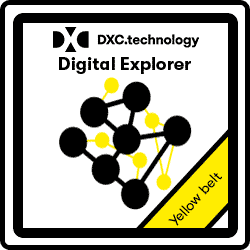

# :construction: Digital Explorer Training :construction:

## White Belt
 

Introduction and awareness of the DE platform

|Topic|Owner|Link
|---|---|---|
|Intro 101| David Stevens|[Link](https://github.com/dxc-technology/dxc-digitalexplorer/blob/master/training/101/DXCDE101.md)
|Overview of the Trends Module| David Stevens|[Link](https://github.com/dxc-technology/dxc-digitalexplorer/blob/master/training/Trends/Trends100/readme.md)
|Overview of the Solutions Module| David Stevens|[Link](https://github.com/dxc-technology/dxc-digitalexplorer/tree/master/training/Solutions)
|Overview of the Workspace module| David Stevens|[Link](https://github.com/dxc-technology/dxc-digitalexplorer/blob/master/training/Workspaces/readme.md)
|Overview of the Roadmaps module| David Stevens|[Link](https://github.com/dxc-technology/dxc-digitalexplorer/blob/master/training/Roadmaps/RoadmapOverview.md)
|Overview of the Playbooks Module| David Stevens|[Link](https://github.com/dxc-technology/dxc-digitalexplorer/blob/master/training/Playbooks/PlaybookOverview.md)
|Exam|David Stevens|[Link](examQuestions.md)

## Yellow Belt

 
Business scenarios and use cases
Creating your client's digital blueprint

|Topic|Owner|Link
|---|---|---|
|Client use case|Phil Mullis|**TO DO**
|Day in the life| David Stevens|**TO DO**
|Creating your digital blueprint|David Stevens|[Link](https://github.com/dxc-technology/dxc-digitalexplorer/blob/master/training/Roadmaps/InitialSetup.md)
|Blueprint 2 ideas|David Stevens|[Link](https://github.com/dxc-technology/dxc-digitalexplorer/blob/master/training/Roadmaps/RoadmapOutput.md) 
|Exam|David Stevens and Phil Mullis|**TO DO**
|Earn `onboard roadmaps` Achievement|David Stevens|_Need to investigate if this can be automated_

## Green Belt
 
Contribution of trends and solutions

|Topic|Owner|Link
|---|---|---|
|Adding a new trend|David Stevens|[Link](https://github.com/dxc-technology/dxc-digitalexplorer/blob/master/training/Trends/ContributingTrends/readme.md)
|Adding a new solution|David Stevens|[Link](https://github.com/dxc-technology/dxc-digitalexplorer/tree/master/training/Solutions/SubmittingSolutions)
|Blueprint idea to solution Canvas|David Stevens & David Knight|[Link](https://github.com/dxc-technology/dxc-digitalexplorer/blob/master/training/Roadmaps/Idea2Solution.md)
|Exam|David Stevens and David Knight|**TO DO**
|Earn `onboard trends` Achievement|David Stevens|_Need to investigate if this can be automated_
|Earn `onboard solutions` Achievement|David Stevens|_Need to investigate if this can be automated_

## Black Belt
 
Governance and champions

|Topic|Owner|Link
|---|---|---|
|Reviewing trends|David Stevens|**TO DO**
|How to promote and share DE content|David Stevens|**TO DO**
|Guidance for a DE workshop|David Stevens|**TO DO**

