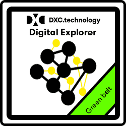

# :construction: Digital Explorer Training :construction:

## White Belt
 

- [DXCU](https://dxc.sabacloud.com/Saba/Web_spf/NA2PRD0005/app/shared;spf-url=common%2Flearningeventdetail%2Fcurra000000000004384)

Introduction and awareness of the DE platform

|Topic|Owner|Link|DXCULink|Duration|
|---|---|---|---|---|
|1 minute introduction to DE|David Stevens| |[DXCU](https://dxc.sabacloud.com/Saba/Web_spf/NA2PRD0005/common/ledetail/00054479) |00:01|
|Overview of the Trends Module| David Stevens|[Link](https://github.com/dxc-technology/dxc-digitalexplorer/blob/master/training/Trends/Trends100/readme.md)|[DXCU](https://dxc.sabacloud.com/Saba/Web_spf/NA2PRD0005/common/ledetail/00054453)|00:01|
|Overview of the Solutions Module| David Stevens|[Link](https://github.com/dxc-technology/dxc-digitalexplorer/tree/master/training/Solutions)|[DXCU](https://dxc.sabacloud.com/Saba/Web_spf/NA2PRD0005/common/ledetail/00054454)
|Overview of the Workspace module| David Stevens|[Link](https://github.com/dxc-technology/dxc-digitalexplorer/blob/master/training/Workspaces/readme.md)|[DXCU](https://dxc.sabacloud.com/Saba/Web_spf/NA2PRD0005/common/ledetail/00054455)
|Overview of the Roadmaps module| David Stevens|[Link](https://github.com/dxc-technology/dxc-digitalexplorer/blob/master/training/Roadmaps/RoadmapOverview.md)|[DXCU](https://dxc.sabacloud.com/Saba/Web_spf/NA2PRD0005/common/ledetail/00054469)
|Overview of the Playbooks Module| David Stevens|[Link](https://github.com/dxc-technology/dxc-digitalexplorer/blob/master/training/Playbooks/PlaybookOverview.md)|[DXCU](https://dxc.sabacloud.com/Saba/Web_spf/NA2PRD0005/common/ledetail/00054446)
|Summary 101| David Stevens|[Link](https://github.com/dxc-technology/dxc-digitalexplorer/blob/master/training/101/DXCDE101.md)|[DXCU](https://dxc.sabacloud.com/Saba/Web_spf/NA2PRD0005/common/ledetail/00054446)|00:40|
|Exam|David Stevens|[Link](examQuestions.md)||00:05|

- [Detailed breakdown for whitebelt courses](DXCUWhiteBeltCourses.md)

## Yellow Belt

 
**Business scenarios and use cases**

|Topic|Owner|Link
|---|---|---|
|Platform - The information journey - Key terms within the Digital Explorer platform|David Stevens|
|Playbooks - View and Present playbooks|David Stevens|
|Playbooks - Create Account/client playbooks|David Stevens|
|Workspaces - Participate in Account workspaces|David Stevens|
|Solutions -  Search for Solutions|David Stevens|
|Trends - Review an industry Trends|David Stevens|

## Orange Belt
 
**Creating your client's digital blueprint**

|Topic|Owner|Link
|---|---|---|
|Workspace 2 Roadmaps - prepare a roadmap from analyzed content|David Stevens|
|Roadmaps - Create account roadmaps (IA/Blueprint)|David Stevens|
|Roadmaps -  Review and contribute to account roadmaps, ideas and initiatives|David Stevens|
|Blueprint idea to solution Canvas|David Stevens & David Knight|[Link](https://github.com/dxc-technology/dxc-digitalexplorer/blob/master/training/Roadmaps/Idea2Solution.md)

## Green Belt
 
**Contribution of trends and solutions**

|Topic|Owner|Link
|---|---|---|
|Trends - Adding a new trend|David Stevens|[Link](https://github.com/dxc-technology/dxc-digitalexplorer/blob/master/training/Trends/ContributingTrends/readme.md)
|Solutions - Adding a new solution|David Stevens|[Link](https://github.com/dxc-technology/dxc-digitalexplorer/tree/master/training/Solutions/SubmittingSolutions)
|Workspaces - Create a shared workspace|David Stevens|
|Playbooks - Create Open playbooks|David Stevens|

## Blue Belt
 
**Governance**

|Topic|Owner|Link
|---|---|---|
|Trends - Reviewing trends|David Stevens|

## Black Belt
 
Advanced Skills

|Topic|Owner|Link
|---|---|---|
|Solutions - Add solutions to workspaces/playbooks|David Stevens|
|Roadmaps - Creating a template|David Stevens|
|Roadmaps - using a template|David Stevens|
|Roadmaps - Program Groups|David Stevens|
|Roadmaps - Idea 2 Solution|David Stevens|
|Roadmaps - Client access to a roadmap|David Stevens|
|Playbooks - Creator tips|David Stevens|
|Platform - How to raise defects and enhancement requests|David Stevens|
