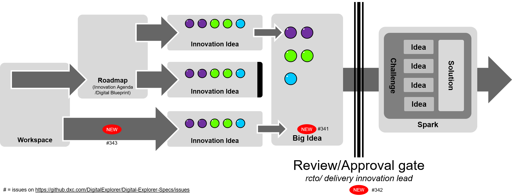
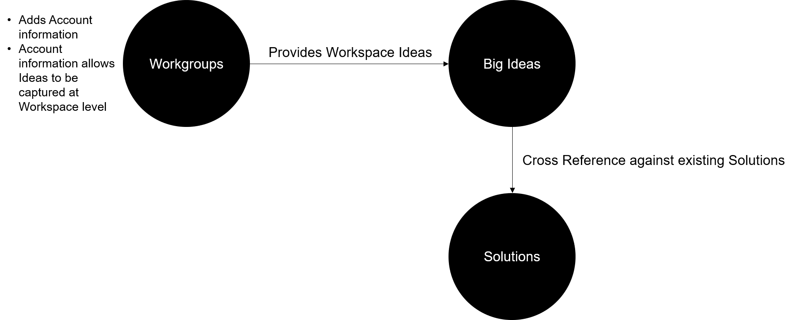

# Digital Explorer FY20 Planning

## Features

### Workgroups
Extend the workgroups functionality to provide a single viewpoint of the overall opportunity/program

### Big Ideas
Identify common ideas across roadmaps and allow regional teams to define areas of investment, includes potential option to transfer to **DXC Spark**

### Solution Models
2 key areas 
- Support TechExcellence 2020
- Support work related to Reference Architecture modelling

### UX Improvements
Covers user feedback to improvement the overall usage of the platform.

### [--> 2020 Project Board](https://github.dxc.com/DigitalExplorer/Digital-Explorer-Specs/projects/7)

### Feature dependencies

---

## Content

- Partner Content
- DTC Content
- Technical Excellence 2020

These entries are tracked within the AO team [Kanban board](https://teams.microsoft.com/l/entity/com.microsoft.teamspace.tab.planner/_djb2_msteams_prefix_449045422?context=%7B%22subEntityId%22%3Anull%2C%22canvasUrl%22%3A%22https%3A%2F%2Ftasks.office.com%2F93f33571-550f-43cf-b09f-cd331338d086%2FHome%2FPlannerFrame%3Fpage%3D7%26planId%3DGYkAWxGqbUa4sTn5ShuOz2QAHI7Z%26auth_pvr%3DOrgid%26auth_upn%3D%7Bupn%7D%26mkt%3D%7Blocale%7D%22%2C%22channelId%22%3A%2219%3Ae7bf523cb66f42c9a5f4c1050f2aea96%40thread.skype%22%7D&groupId=0b29bfab-5619-49a5-8d84-b45342a59fcd&tenantId=93f33571-550f-43cf-b09f-cd331338d086)

## Training

Yellow, Orange,  Green and Blue belt training plans to be completed.

### [DE Training outline](../DETraining/DETraining.md)