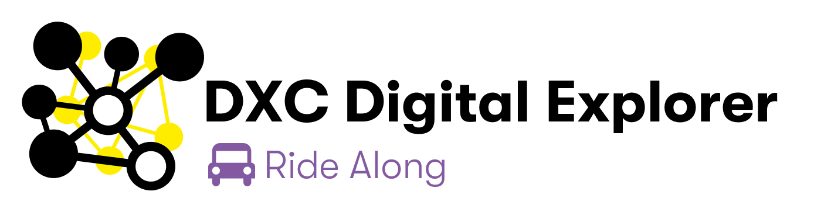
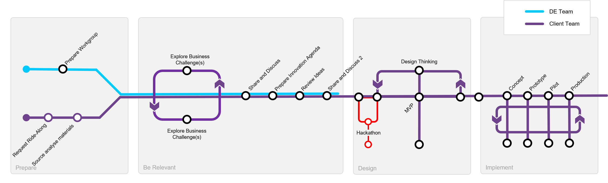

 

The Digital Explorer ride-along is aimed to support account teams to help them leverage the highest value from the [DXC Digital Explorer](https://digitalexplorer.dxc.com) platform.

## Example outcomes
- Provide industry insights against client material *(Digital Explorer Workspace)*
- Prepare input into client innovation agenda *(Digital Explorer Roadmaps)*
- Create draft innovation agenda *(Digital Explorer Roadmaps)*
- Capture initial ideas to discuss with client *(Digital Explorer Roadmaps)*
- Identify matching DXC and Partner solutions *(Digital Explorer Solutions)*
- Identify similar ideas across industries *(Digital Explorer Roadmaps)*
- Draft client facing playbook *(Digital Explorer Playbooks)*

## Potential engagements
- Existing accounts looking for growth opportunities
- New logo/RFP analysis
- Industry/market analysis
- Industry Squad support
- Preparation for Client Innovation Centre workshops

## Duration
The initial ride-along can be between 1 and 2 weeks depending on the level of engagement required.

## Coaching and debriefs
The Ride-along team will provide all content created to the client team and a set of suggested next steps.   The Ride-along team are also available to continue the support of the client journey if required.

## Requests

Please raise your request [here](https://github.dxc.com/DigitalExplorer/Digital-Explorer-Specs/issues/new?template=rideAlong_request.md)

## Sample Output

- [Example client playbook](https://digitalexplorer.dxc.com/pb/playbook/207321)
- [Example client Workgroup](https://digitalexplorer.dxc.com/dew/workspace-group/199064)
- [Example client workspace](https://digitalexplorer.dxc.com/dew/workspace/creator/199423)

---

### *References*

- [Getting started with DXC Digital Explorer](https://github.com/dxc-technology/dxc-digitalexplorer/blob/master/training/200/readme.md)
- [DXC Digital Explorer White Belt training](https://dxc.sabacloud.com/Saba/Web_spf/NA2PRD0005/app/shared;spf-url=common%2Flearningeventdetail%2Fcurra000000000004384)
- [DXC Digital Explorer Yellow Belt training](https://dxc.sabacloud.com/Saba/Web_spf/NA2PRD0005/app/shared;spf-url=common%2Flearningeventdetail%2Fcurra000000000004500)
- [DXC Digital Explorer Orange Belt training](https://dxc.sabacloud.com/Saba/Web_spf/NA2PRD0005/app/shared;spf-url=common%2Flearningeventdetail%2Fcurra000000000004560)