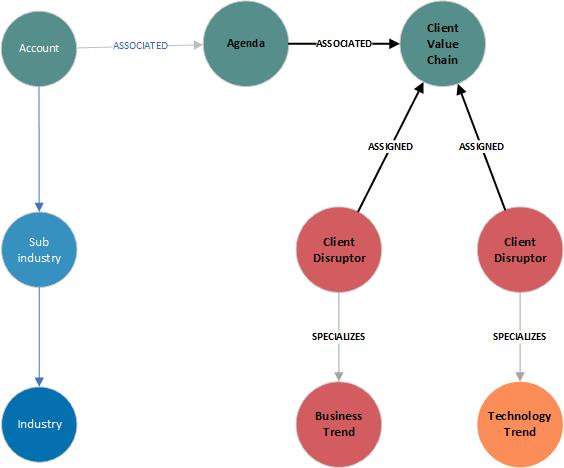
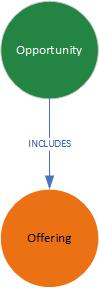
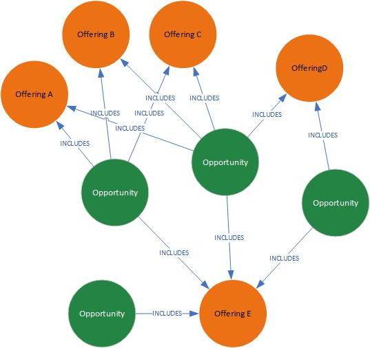

# Model views and scenerios

## Agendas

### Scenerios

* near neighbours of a named trend
* near neighbours of a group of trends
* 

## Sales Model

* near neighbours of an offerings
* near neighbours of a group of offerings